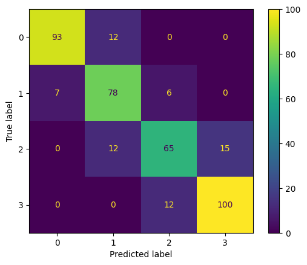
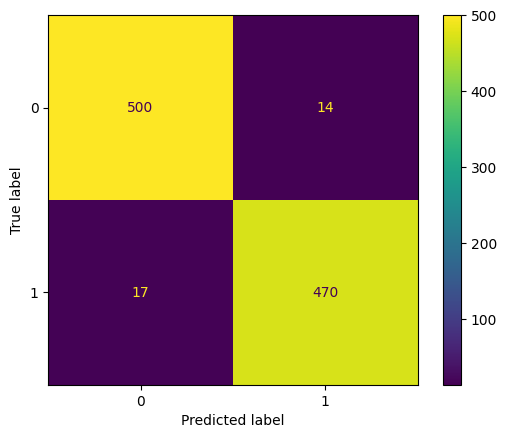
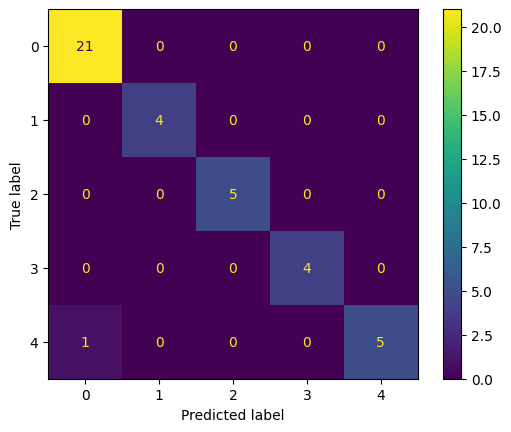

# Porównanie rozmytego i klasycznego drzewa decyzyjnego

## Wstęp

Celem tego projektu było porównanie wybranych parametrów klasyfikacji za pomocą rozmytego i klasycznego drzewa decyzyjnego. W tym celu wykorzystano dziesięć zbiorów danych pobranych ze strony [Kaggle](https://www.kaggle.com/), za pomocą bibliotek [fuzzy-tree](https://balins.github.io/fuzzytree/index.html) i [Sklearn](https://scikit-learn.org/stable/) zbudowano odpowiednio rozmyte i klasyczne drzewo decyzyjne oraz za pomocą skryptu w języku Python wygenerowano raport z wybranymi statystykami.

## Opis zbiorów danych
### animals
Ten zbiór danych składa się z 101 zwierząt z ogrodu zoologicznego.
Istnieje 16 zmiennych z różnymi cechami, które opisują zwierzęta.
7 typów klas to: Ssak, Ptak, Gad, Ryba, Płaz, Robal i Bezkręgowiec.

Celem tego zbioru danych jest możliwość przewidzenia klasyfikacji zwierząt na podstawie zmiennych.
Jest to idealny zestaw danych dla tych, którzy dopiero uczą się uczenia maszynowego.

Informacje o atrybutach: (nazwa atrybutu i typ domeny wartości)

* animal_name: Unique for each instance
* hair Boolean
* feathers Boolean
* eggs Boolean
* milk Boolean
* airborne Boolean
* aquatic Boolean
* predator Boolean
* toothed Boolean
* backbone Boolean
* breathes Boolean
* venomous Boolean
* fins Boolean
* legs Numeric (set of values: {0,2,4,5,6,8})
* tail Boolean
* domestic Boolean
* catsize Boolean
* class_type Numeric (integer values in range [1,7])
### fetal_health
Kontekst

Zmniejszenie umieralności dzieci znajduje odzwierciedlenie w kilku Celach Zrównoważonego Rozwoju ONZ i jest kluczowym wskaźnikiem postępu ludzkości.
ONZ oczekuje, że do 2030 roku kraje położą kres możliwym do uniknięcia zgonom noworodków i dzieci poniżej 5 roku życia, a wszystkie kraje będą dążyć do zmniejszenia umieralności dzieci poniżej 5 roku życia do poziomu co najmniej 25 na 1000 żywych urodzeń.

Równolegle do pojęcia śmiertelności dzieci jest oczywiście śmiertelność matek, która stanowi 295 000 zgonów podczas i po ciąży oraz porodzie (stan na 2017 r.). Zdecydowana większość tych zgonów (94%) miała miejsce w warunkach niskich zasobów, a większości z nich można było zapobiec.

W świetle tego, co zostało wspomniane powyżej, kardiotokogramy (CTG) są prostą i dostępną pod względem kosztów opcją oceny zdrowia płodu, umożliwiając pracownikom służby zdrowia podjęcie działań w celu zapobiegania śmiertelności dzieci i matek. Sam sprzęt działa poprzez wysyłanie impulsów ultradźwiękowych i odczytywanie ich odpowiedzi, rzucając w ten sposób światło na tętno płodu (FHR), ruchy płodu, skurcze macicy i inne.

Dane

Ten zbiór danych zawiera 2126 rekordów cech wyodrębnionych z badań kardiotokograficznych, które następnie zostały sklasyfikowane przez trzech ekspertów położników na 3 klasy:
* Normalny
* Podejrzany
* Patologiczny
### glass
Kontekst

To jest zestaw danych identyfikacyjnych szkła z UCI. Zawiera 10 atrybutów w tym id. Odpowiedzią jest typ szkła (dyskretne 7 wartości)

Zawartość:

Informacje o atrybucie:

* Numer Id: od 1 do 214 (usunięty z pliku CSV),
* RI: współczynnik załamania światła,
* Na: Sód (pomiar jednostkowy: procent wagowy w odpowiednim tlenku, podobnie jak atrybuty 4-10),
* Mg: Magnesium,
* Al: Aluminium,
* Si: Krzem,
* K: Potas,
* Ca: Wapń,
* Ba: Barium,
* Fe: Żelazo,
* Rodzaj szkła: (atrybut klasy)
    * 1 building_windows_float_processed,
    * 2 building_windows_non_float_processed,
    * 3 vehicle_windows_float_processed,
    * 4 vehicle_windows_non_float_processed (brak w tej bazie danych),
    * 5 containers,
    * 6 tableware,
    * 7 headlamps,
### heart_attack
Zestaw danych, który na podstawie parametrów pacjenta określa prawdopodobieństwo zawału.

Lista cech:

* Age : Wiek pacjenta
* Gender : Płeć pacjenta
* exang: dławica piersiowa wywołana wysiłkiem fizycznym (1 = tak; 0 = nie)
* ca: liczba głównych naczyń (0-3)
* cp : Typ bólu w klatce piersiowej (chest pain type)
  * Wartość 1: typowa dławica piersiowa,
  * Wartość 2: dławica piersiowa nietypowa,
  * Wartość 3: ból nieanginalny,
  * Wartość 4: bezobjawowy,
* trtbps : spoczynkowe ciśnienie krwi (w mm Hg)
* chol : cholesterol w mg/dl pobierany przez czujnik BMI
* fbs : (cukier we krwi na czczo > 120 mg/dl) (1 = prawda; 0 = fałsz)
* rest_ecg : wyniki elektrokardiograficzne w spoczynku
  * Wartość 0: normalny,
  * Wartość 1: posiadanie nieprawidłowości w zakresie fali ST-T (inwersje fali T i/lub uniesienie lub obniżenie odcinka ST o > 0,05 mV),
  * Wartość 2: wykazujący prawdopodobny lub definitywny przerost lewej komory według kryteriów Estesa,
* thalach : osiągnięta maksymalna częstość akcji serca
* target: 0= mniejsze prawdopodobieństwo zawału serca 1= większe prawdopodobieństwo zawału serca
### mobile_price
Zestaw danych zawierający dane techniczne telefonów komórkowych, które są przypisane do 4 klas cenowych. Są to takie cechy jak np RAM, pamięć wewnętrzna czy pojemność baterii.

### gender
Zestaw danych zawierający wymienione niżej cechy twarzy, w podziale na mężczyznę i kobietę.

Ten zbiór danych zawiera 7 cech i kolumnę etykiet.

* long_hair - Ta kolumna zawiera 0 i 1, gdzie 1 to "długie włosy", a 0 to "nie długie włosy".
* forehead_width_cm - Ta kolumna jest w CM. Jest to szerokość czoła.
* forehead_height_cm - Jest to wysokość czoła podana w centymetrach.
* nose_wide - Ta kolumna zawiera 0 i 1, gdzie 1 oznacza "szeroki nos", a 0 "nie szeroki nos".
* nose_long - Ta kolumna zawiera 0 i 1, gdzie 1 oznacza "długi nos", a 0 "nie długi nos".
* lips_thin - Ta kolumna zawiera 0 i 1, gdzie 1 oznacza "cienkie usta", a 0 "nie cienkie usta".
* distance_nose_to_lip_long - Ta kolumna zawiera 0 i 1, gdzie 1 reprezentuje "dużą odległość między nosem a ustami", podczas gdy 0 oznacza "małą odległość między nosem a ustami".
* gender - Jest to albo "Mężczyzna" albo "Kobieta".
### oil_spill
Zestaw danych został opracowany na podstawie zdjęć satelitarnych oceanu, z których część zawierała wyciek ropy, a część nie.
Obrazy zostały podzielone na sekcje i przetworzone za pomocą algorytmów wizji komputerowej, aby dostarczyć wektor cech opisujących zawartość sekcji obrazu lub łaty.
Zadanie polega na tym, że biorąc pod uwagę wektor opisujący zawartość łaty obrazu satelitarnego, przewiduje się, czy łata ta zawiera wyciek ropy, czy nie, np. z nielegalnego lub przypadkowego wyrzucenia ropy do oceanu.

Istnieją dwie klasy, a celem jest rozróżnienie pomiędzy spill i non-spill przy użyciu cech dla danej łaty oceanu.

Non-Spill: przypadek negatywny, czyli klasa większości.
Oil Spill: przypadek pozytywny, czyli klasa mniejszości.
### diabetes
Cukrzyca jest jedną z najszybciej rozwijających się przewlekłych chorób zagrażających życiu, która według raportu Światowej Organizacji Zdrowia (WHO), w 2018 roku dotknęła już 422 miliony ludzi na całym świecie. Ze względu na obecność stosunkowo długiej fazy bezobjawowej, wczesne wykrycie cukrzycy jest zawsze pożądane dla uzyskania istotnego klinicznie wyniku. Około 50% wszystkich osób cierpiących na cukrzycę jest niezdiagnozowanych z powodu jej długotrwałej fazy bezobjawowej.

Ten zbiór danych zawiera 520 obserwacji z 17 cechami, zebranych przy użyciu bezpośrednich kwestionariuszy i wyników diagnozy od pacjentów w Sylhet Diabetes Hospital w Sylhet w Bangladeszu.
### drugs
Ten zbiór danych zawiera informacje o klasyfikacji leków na podstawie ogólnych informacji o pacjencie i jego diagnozie. Model uczenia maszynowego jest potrzebny, aby przewidzieć wynik typu leków, które mogą być odpowiednie dla pacjenta.

Cechą docelową jest:
* Rodzaj leku

Zestawy cech to:
* Wiek,
* Płeć,
* Poziomy ciśnienia krwi (BP),
* Poziomy cholesterolu,
* Stosunek Na do Potasu
### wine
Zestaw danych dotyczy próbek czerwonego i białego wina vinho verde z północnej Portugalii. Celem jest modelowanie jakości wina w oparciu o testy fizykochemiczne.

Informacje o atrybutach:

Zmienne wejściowe (oparte na testach fizykochemicznych):
* kwasowość stała,
* kwasowość lotna,
* kwas cytrynowy,
* cukier resztkowy,
* chlorki,
* wolny dwutlenek siarki,
* całkowity dwutlenek siarki,
* gęstość,
* pH,
* siarczany,
* alkohol

Zmienna wyjściowa (na podstawie danych sensorycznych):
* jakość ("dobra" i "zła" na podstawie wyniku >5 i <5)

## Algorytm budowania rozmytego drzewa decyzyjnego

## Raport
Poniższy Raport zawiera dla każdego zbioru danych informacje o tym jak długo trwało budowanie drzew, ich użycie, dokładność klasyfikacji na zbiorze testującym oraz macież błędów która może zostać użyta do dalszej analizy.

## Zbiór danych: animals

| Metryka | Klasyczne drzewo decyzyjne | Rozmyte drzewo decyzyjne 
| --- | --- | --- 
| Czas budowy [ms] |  1.45721435546875  |  8.97979736328125
| Czas użycia [ms] |  0.09393692016601562  |  0.13494491577148438
| Dokładność |  0.9523809523809523  |  0.9523809523809523
| Precyzja makro | 0.7142857142857143  |  0.7142857142857143
| Precyzja mikro | 0.9523809523809523  |  0.9523809523809523
| Czułość makro | 0.7142857142857143  |  0.7142857142857143
| Czułość mikro | 0.9523809523809523  |  0.9523809523809523
| F1 makro | 0.7142857142857143  |  0.7142857142857143
| F1 mikro | 0.9523809523809523  |  0.9523809523809523
| Macierz błędów |   |  

---

## Zbiór danych: fetal_health

| Metryka | Klasyczne drzewo decyzyjne | Rozmyte drzewo decyzyjne 
| --- | --- | --- 
| Czas budowy [ms] |  8.036136627197266  |  89666.00298881531
| Czas użycia [ms] |  0.07891654968261719  |  20.978927612304688
| Dokładność |  **0.9272300469483568**  |  0.9248826291079812
| Precyzja makro | 0.8781773108432261  |  **0.9214287001495739**
| Precyzja mikro | **0.9272300469483568**  |  0.9248826291079812
| Czułość makro | **0.9121950614407511**  |  0.8313550619585102
| Czułość mikro | **0.9272300469483568**  |  0.9248826291079812
| F1 makro | **0.8944282811226346**  |  0.8712696199001737
| F1 mikro | **0.9272300469483568**  |  0.9248826291079812
| Macierz błędów |   |  

---

## Zbiór danych: glass

| Metryka | Klasyczne drzewo decyzyjne | Rozmyte drzewo decyzyjne 
| --- | --- | --- 
| Czas budowy [ms] |  0.6201267242431641  |  2214.6801948547363
| Czas użycia [ms] |  0.051975250244140625  |  1.1150836944580078
| Dokładność |  0.7441860465116279  |  **0.7674418604651163**
| Precyzja makro | **0.7630291005291006**  |  0.6648809523809524
| Precyzja mikro | 0.7441860465116279  |  **0.7674418604651163**
| Czułość makro | **0.7765151515151515**  |  0.6644119769119768
| Czułość mikro | 0.7441860465116279  |  **0.7674418604651163**
| F1 makro | **0.6990344622697564**  |  0.659571702244116
| F1 mikro | 0.7441860465116278  |  **0.7674418604651162**
| Macierz błędów |   |  

---

## Zbiór danych: heart_attack

| Metryka | Klasyczne drzewo decyzyjne | Rozmyte drzewo decyzyjne 
| --- | --- | --- 
| Czas budowy [ms] |  0.5500316619873047  |  1346.1709022521973
| Czas użycia [ms] |  0.03790855407714844  |  1.386880874633789
| Dokładność |  0.819672131147541  |  0.819672131147541
| Precyzja makro | **0.826797385620915**  |  0.8193548387096774
| Precyzja mikro | 0.819672131147541  |  0.819672131147541
| Czułość makro | **0.8232758620689655**  |  0.8200431034482758
| Czułość mikro | 0.819672131147541  |  0.819672131147541
| F1 makro | **0.8194780737153619**  |  0.8194780737153617
| F1 mikro | 0.819672131147541  |  0.819672131147541
| Macierz błędów |   |  

---

## Zbiór danych: mobile_price

| Metryka | Klasyczne drzewo decyzyjne | Rozmyte drzewo decyzyjne 
| --- | --- | --- 
| Czas budowy [ms] |  7.650136947631836  |  182171.00429534912
| Czas użycia [ms] |  0.07200241088867188  |  28.44977378845215
| Dokładność |  0.8275  |  **0.9125**
| Precyzja makro | 0.8245807493599755  |  **0.9110206137010463**
| Precyzja mikro | 0.8275  |  **0.9125**
| Czułość makro | 0.8220999562032172  |  **0.9124049410734194**
| Czułość mikro | 0.8275  |  **0.9125**
| F1 makro | 0.8215354367350738  |  **0.9107510030783866**
| F1 mikro | 0.8275  |  **0.9125**
| Macierz błędów |   |  

---

## Zbiór danych: gender

| Metryka | Klasyczne drzewo decyzyjne | Rozmyte drzewo decyzyjne 
| --- | --- | --- 
| Czas budowy [ms] |  3.9985179901123047  |  16913.99574279785
| Czas użycia [ms] |  0.0  |  67.99936294555664
| Dokładność |  0.952047952047952  |  **0.9660339660339661**
| Precyzja makro | 0.9520860781730347  |  **0.9661161776684608**
| Precyzja mikro | 0.952047952047952  |  **0.9660339660339661**
| Czułość makro | 0.9520355451939736  |  **0.9660156967321096**
| Czułość mikro | 0.952047952047952  |  **0.9660339660339661**
| F1 makro | 0.9520456069751846  |  **0.9660312200574896**
| F1 mikro | 0.952047952047952  |  **0.9660339660339661**
| Macierz błędów |   |  

---

## Zbiór danych: oil_spill

| Metryka | Klasyczne drzewo decyzyjne | Rozmyte drzewo decyzyjne 
| --- | --- | --- 
| Czas budowy [ms] |  14.998674392700195  |  276526.24440193176
| Czas użycia [ms] |  0.0  |  10.030984878540039
| Dokładność |  **0.9787234042553191**  |  0.9680851063829787
| Precyzja makro | **0.8097222222222222**  |  0.7391304347826086
| Precyzja mikro | **0.9787234042553191**  |  0.9680851063829787
| Czułość makro | **0.9084249084249084**  |  0.6611721611721612
| Czułość mikro | **0.9787234042553191**  |  0.9680851063829787
| F1 makro | **0.8516179952644041**  |  0.6918032786885246
| F1 mikro | **0.9787234042553191**  |  0.9680851063829787
| Macierz błędów |   |  

---

## Zbiór danych: diabetes

| Metryka | Klasyczne drzewo decyzyjne | Rozmyte drzewo decyzyjne 
| --- | --- | --- 
| Czas budowy [ms] |  0.9965896606445312  |  248.96955490112305
| Czas użycia [ms] |  0.0  |  1.0006427764892578
| Dokładność |  **0.9519230769230769**  |  0.9423076923076923
| Precyzja makro | **0.9370915032679739**  |  0.9249697458652683
| Precyzja mikro | **0.9519230769230769**  |  0.9423076923076923
| Czułość makro | **0.9566794707639779**  |  0.9496372172428511
| Czułość mikro | **0.9519230769230769**  |  0.9423076923076923
| F1 makro | **0.9457825044312376**  |  0.9354037267080746
| F1 mikro | **0.9519230769230769**  |  0.9423076923076923
| Macierz błędów |   |  

---

## Zbiór danych: drugs

| Metryka | Klasyczne drzewo decyzyjne | Rozmyte drzewo decyzyjne 
| --- | --- | --- 
| Czas budowy [ms] |  1.0008811950683594  |  1288.9668941497803
| Czas użycia [ms] |  0.0  |  4.997491836547852
| Dokładność |  **1.0**  |  0.975
| Precyzja makro | **1.0**  |  0.9875
| Precyzja mikro | **1.0**  |  0.975
| Czułość makro | **1.0**  |  0.96
| Czułość mikro | **1.0**  |  0.975
| F1 makro | **1.0**  |  0.9713261648745519
| F1 mikro | **1.0**  |  0.975
| Macierz błędów |   |  

---

## Zbiór danych: wine

| Metryka | Klasyczne drzewo decyzyjne | Rozmyte drzewo decyzyjne 
| --- | --- | --- 
| Czas budowy [ms] |  6.994962692260742  |  185129.49752807617
| Czas użycia [ms] |  0.0  |  36.03386878967285
| Dokładność |  0.721875  |  **0.73125**
| Precyzja makro | 0.7186517913262099  |  **0.7279304785498014**
| Precyzja mikro | 0.721875  |  **0.73125**
| Czułość makro | 0.7205317167875114  |  **0.7296644082570625**
| Czułość mikro | 0.721875  |  **0.73125**
| F1 makro | 0.719240134465048  |  **0.7285353535353535**
| F1 mikro | 0.7218749999999999  |  **0.73125**
| Macierz błędów |   |  

---

## Podsumowanie
