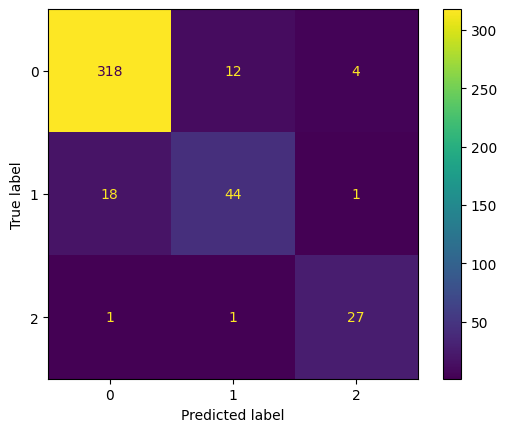
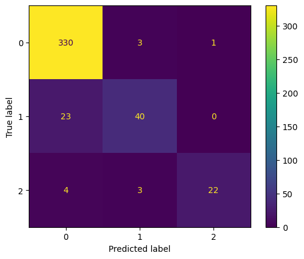
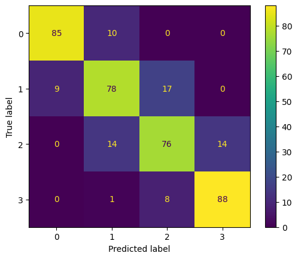
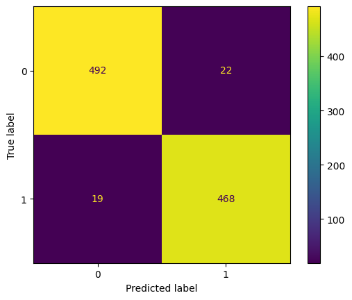
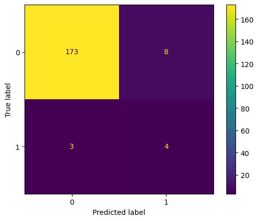
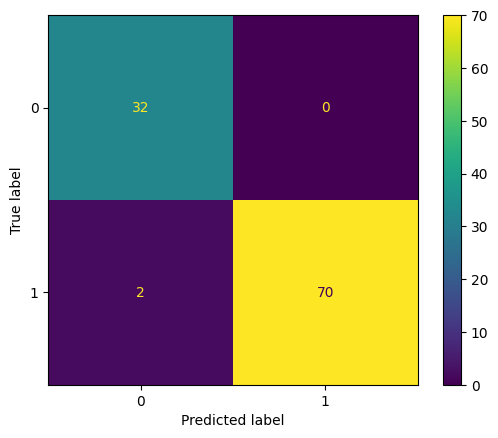
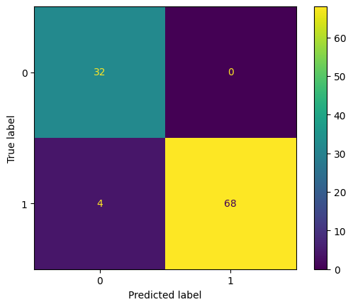
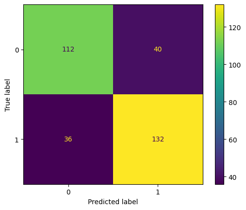

## Zbiór danych: animals
### Statystyki zbioru
|          |   count |      mean |      std |   min |   25% |   50% |   75% |   max |
|:---------|--------:|----------:|---------:|------:|------:|------:|------:|------:|
| hair     |     101 | 0.425743  | 0.496921 |     0 |     0 |     0 |     1 |     1 |
| feathers |     101 | 0.19802   | 0.400495 |     0 |     0 |     0 |     0 |     1 |
| eggs     |     101 | 0.584158  | 0.495325 |     0 |     0 |     1 |     1 |     1 |
| milk     |     101 | 0.405941  | 0.493522 |     0 |     0 |     0 |     1 |     1 |
| airborne |     101 | 0.237624  | 0.42775  |     0 |     0 |     0 |     0 |     1 |
| aquatic  |     101 | 0.356436  | 0.481335 |     0 |     0 |     0 |     1 |     1 |
| predator |     101 | 0.554455  | 0.499505 |     0 |     0 |     1 |     1 |     1 |
| toothed  |     101 | 0.60396   | 0.491512 |     0 |     0 |     1 |     1 |     1 |
| backbone |     101 | 0.821782  | 0.384605 |     0 |     1 |     1 |     1 |     1 |
| breathes |     101 | 0.792079  | 0.407844 |     0 |     1 |     1 |     1 |     1 |
| venomous |     101 | 0.0792079 | 0.27141  |     0 |     0 |     0 |     0 |     1 |
| fins     |     101 | 0.168317  | 0.376013 |     0 |     0 |     0 |     0 |     1 |
| legs     |     101 | 2.84158   | 2.03338  |     0 |     2 |     4 |     4 |     8 |
| tail     |     101 | 0.742574  | 0.439397 |     0 |     0 |     1 |     1 |     1 |
| domestic |     101 | 0.128713  | 0.336552 |     0 |     0 |     0 |     0 |     1 |
| catsize  |     101 | 0.435644  | 0.498314 |     0 |     0 |     0 |     1 |     1 |
### Metryki klasyfikatorów
| Metryka | Klasyczne drzewo decyzyjne | Rozmyte drzewo decyzyjne 
| --- | --- | --- 
| Czas budowy [ms] |  0.5559921264648438  |  8.935928344726562
| Czas użycia [ms] |  0.28705596923828125  |  0.5459785461425781
| Dokładność |  0.9523809523809523  |  0.9523809523809523
| Precyzja makro | 0.7142857142857143  |  0.7142857142857143
| Precyzja mikro | 0.9523809523809523  |  0.9523809523809523
| Czułość makro | 0.7142857142857143  |  0.7142857142857143
| Czułość mikro | 0.9523809523809523  |  0.9523809523809523
| F1 makro | 0.7142857142857143  |  0.7142857142857143
| F1 mikro | 0.9523809523809523  |  0.9523809523809523
| Macierz błędów |   |  

---

## Zbiór danych: fetal_health
### Statystyki zbioru
|                                                        |   count |          mean |          std |   min |     25% |     50% |     75% |     max |
|:-------------------------------------------------------|--------:|--------------:|-------------:|------:|--------:|--------:|--------:|--------:|
| baseline value                                         |    2126 | 133.304       |  9.84084     | 106   | 126     | 133     | 140     | 160     |
| accelerations                                          |    2126 |   0.00317827  |  0.00386559  |   0   |   0     |   0.002 |   0.006 |   0.019 |
| fetal_movement                                         |    2126 |   0.00948071  |  0.0466658   |   0   |   0     |   0     |   0.003 |   0.481 |
| uterine_contractions                                   |    2126 |   0.00436642  |  0.00294607  |   0   |   0.002 |   0.004 |   0.007 |   0.015 |
| light_decelerations                                    |    2126 |   0.00188946  |  0.00296021  |   0   |   0     |   0     |   0.003 |   0.015 |
| severe_decelerations                                   |    2126 |   3.29257e-06 |  5.72998e-05 |   0   |   0     |   0     |   0     |   0.001 |
| prolongued_decelerations                               |    2126 |   0.000158514 |  0.000589948 |   0   |   0     |   0     |   0     |   0.005 |
| abnormal_short_term_variability                        |    2126 |  46.9901      | 17.1928      |  12   |  32     |  49     |  61     |  87     |
| mean_value_of_short_term_variability                   |    2126 |   1.33278     |  0.883241    |   0.2 |   0.7   |   1.2   |   1.7   |   7     |
| percentage_of_time_with_abnormal_long_term_variability |    2126 |   9.84666     | 18.3969      |   0   |   0     |   0     |  11     |  91     |
| mean_value_of_long_term_variability                    |    2126 |   8.18763     |  5.62825     |   0   |   4.6   |   7.4   |  10.8   |  50.7   |
| histogram_width                                        |    2126 |  70.4459      | 38.9557      |   3   |  37     |  67.5   | 100     | 180     |
| histogram_min                                          |    2126 |  93.5795      | 29.5602      |  50   |  67     |  93     | 120     | 159     |
| histogram_max                                          |    2126 | 164.025       | 17.9442      | 122   | 152     | 162     | 174     | 238     |
| histogram_number_of_peaks                              |    2126 |   4.0682      |  2.94939     |   0   |   2     |   3     |   6     |  18     |
| histogram_number_of_zeroes                             |    2126 |   0.323612    |  0.706059    |   0   |   0     |   0     |   0     |  10     |
| histogram_mode                                         |    2126 | 137.452       | 16.3813      |  60   | 129     | 139     | 148     | 187     |
| histogram_mean                                         |    2126 | 134.611       | 15.5936      |  73   | 125     | 136     | 145     | 182     |
| histogram_median                                       |    2126 | 138.09        | 14.4666      |  77   | 129     | 139     | 148     | 186     |
| histogram_variance                                     |    2126 |  18.8081      | 28.9776      |   0   |   2     |   7     |  24     | 269     |
| histogram_tendency                                     |    2126 |   0.32032     |  0.610829    |  -1   |   0     |   0     |   1     |   1     |
### Metryki klasyfikatorów
| Metryka | Klasyczne drzewo decyzyjne | Rozmyte drzewo decyzyjne 
| --- | --- | --- 
| Czas budowy [ms] |  8.1939697265625  |  100614.4049167633
| Czas użycia [ms] |  0.35190582275390625  |  23.49996566772461
| Dokładność |  0.9225352112676056  |  **0.9248826291079812**
| Precyzja makro | 0.8624743818950856  |  **0.9214287001495739**
| Precyzja mikro | 0.9225352112676056  |  **0.9248826291079812**
| Czułość makro | **0.9101930594387491**  |  0.8313550619585102
| Czułość mikro | 0.9225352112676056  |  **0.9248826291079812**
| F1 makro | **0.8848124947551842**  |  0.8712696199001737
| F1 mikro | 0.9225352112676056  |  **0.9248826291079812**
| Macierz błędów |   |  

---

## Zbiór danych: glass
### Statystyki zbioru
|    |   count |       mean |        std |      min |      25% |      50% |      75% |      max |
|:---|--------:|-----------:|-----------:|---------:|---------:|---------:|---------:|---------:|
| RI |     214 |  1.51837   | 0.00303686 |  1.51115 |  1.51652 |  1.51768 |  1.51916 |  1.53393 |
| Na |     214 | 13.4079    | 0.816604   | 10.73    | 12.9075  | 13.3     | 13.825   | 17.38    |
| Mg |     214 |  2.68453   | 1.44241    |  0       |  2.115   |  3.48    |  3.6     |  4.49    |
| Al |     214 |  1.44491   | 0.49927    |  0.29    |  1.19    |  1.36    |  1.63    |  3.5     |
| Si |     214 | 72.6509    | 0.774546   | 69.81    | 72.28    | 72.79    | 73.0875  | 75.41    |
| K  |     214 |  0.497056  | 0.652192   |  0       |  0.1225  |  0.555   |  0.61    |  6.21    |
| Ca |     214 |  8.95696   | 1.42315    |  5.43    |  8.24    |  8.6     |  9.1725  | 16.19    |
| Ba |     214 |  0.175047  | 0.497219   |  0       |  0       |  0       |  0       |  3.15    |
| Fe |     214 |  0.0570093 | 0.0974387  |  0       |  0       |  0       |  0.1     |  0.51    |
### Metryki klasyfikatorów
| Metryka | Klasyczne drzewo decyzyjne | Rozmyte drzewo decyzyjne 
| --- | --- | --- 
| Czas budowy [ms] |  0.9191036224365234  |  2235.8641624450684
| Czas użycia [ms] |  0.26702880859375  |  1.5208721160888672
| Dokładność |  **0.7906976744186046**  |  0.7674418604651163
| Precyzja makro | **0.8296957671957671**  |  0.6648809523809524
| Precyzja mikro | **0.7906976744186046**  |  0.7674418604651163
| Czułość makro | **0.845959595959596**  |  0.6644119769119768
| Czułość mikro | **0.7906976744186046**  |  0.7674418604651163
| F1 makro | **0.8073677956030898**  |  0.659571702244116
| F1 mikro | **0.7906976744186046**  |  0.7674418604651162
| Macierz błędów |   |  

---

## Zbiór danych: heart_attack
### Statystyki zbioru
|          |   count |       mean |       std |   min |   25% |   50% |   75% |   max |
|:---------|--------:|-----------:|----------:|------:|------:|------:|------:|------:|
| age      |     303 |  54.3663   |  9.0821   |    29 |  47.5 |  55   |  61   |  77   |
| sex      |     303 |   0.683168 |  0.466011 |     0 |   0   |   1   |   1   |   1   |
| cp       |     303 |   0.966997 |  1.03205  |     0 |   0   |   1   |   2   |   3   |
| trtbps   |     303 | 131.624    | 17.5381   |    94 | 120   | 130   | 140   | 200   |
| chol     |     303 | 246.264    | 51.8308   |   126 | 211   | 240   | 274.5 | 564   |
| fbs      |     303 |   0.148515 |  0.356198 |     0 |   0   |   0   |   0   |   1   |
| restecg  |     303 |   0.528053 |  0.52586  |     0 |   0   |   1   |   1   |   2   |
| thalachh |     303 | 149.647    | 22.9052   |    71 | 133.5 | 153   | 166   | 202   |
| exng     |     303 |   0.326733 |  0.469794 |     0 |   0   |   0   |   1   |   1   |
| oldpeak  |     303 |   1.0396   |  1.16108  |     0 |   0   |   0.8 |   1.6 |   6.2 |
| slp      |     303 |   1.39934  |  0.616226 |     0 |   1   |   1   |   2   |   2   |
| caa      |     303 |   0.729373 |  1.02261  |     0 |   0   |   0   |   1   |   4   |
| thall    |     303 |   2.31353  |  0.612277 |     0 |   2   |   2   |   3   |   3   |
### Metryki klasyfikatorów
| Metryka | Klasyczne drzewo decyzyjne | Rozmyte drzewo decyzyjne 
| --- | --- | --- 
| Czas budowy [ms] |  0.8759498596191406  |  1346.9150066375732
| Czas użycia [ms] |  0.308990478515625  |  1.8341541290283203
| Dokładność |  0.819672131147541  |  0.819672131147541
| Precyzja makro | **0.8216594827586207**  |  0.8193548387096774
| Precyzja mikro | 0.819672131147541  |  0.819672131147541
| Czułość makro | **0.8216594827586207**  |  0.8200431034482758
| Czułość mikro | 0.819672131147541  |  0.819672131147541
| F1 makro | **0.8196721311475409**  |  0.8194780737153617
| F1 mikro | 0.819672131147541  |  0.819672131147541
| Macierz błędów |   |  

---

## Zbiór danych: mobile_price
### Statystyki zbioru
|               |   count |       mean |         std |   min |     25% |    50% |     75% |   max |
|:--------------|--------:|-----------:|------------:|------:|--------:|-------:|--------:|------:|
| battery_power |    2000 | 1238.52    |  439.418    | 501   |  851.75 | 1226   | 1615.25 |  1998 |
| blue          |    2000 |    0.495   |    0.5001   |   0   |    0    |    0   |    1    |     1 |
| clock_speed   |    2000 |    1.52225 |    0.816004 |   0.5 |    0.7  |    1.5 |    2.2  |     3 |
| dual_sim      |    2000 |    0.5095  |    0.500035 |   0   |    0    |    1   |    1    |     1 |
| fc            |    2000 |    4.3095  |    4.34144  |   0   |    1    |    3   |    7    |    19 |
| four_g        |    2000 |    0.5215  |    0.499662 |   0   |    0    |    1   |    1    |     1 |
| int_memory    |    2000 |   32.0465  |   18.1457   |   2   |   16    |   32   |   48    |    64 |
| m_dep         |    2000 |    0.50175 |    0.288416 |   0.1 |    0.2  |    0.5 |    0.8  |     1 |
| mobile_wt     |    2000 |  140.249   |   35.3997   |  80   |  109    |  141   |  170    |   200 |
| n_cores       |    2000 |    4.5205  |    2.28784  |   1   |    3    |    4   |    7    |     8 |
| pc            |    2000 |    9.9165  |    6.06431  |   0   |    5    |   10   |   15    |    20 |
| px_height     |    2000 |  645.108   |  443.781    |   0   |  282.75 |  564   |  947.25 |  1960 |
| px_width      |    2000 | 1251.52    |  432.199    | 500   |  874.75 | 1247   | 1633    |  1998 |
| ram           |    2000 | 2124.21    | 1084.73     | 256   | 1207.5  | 2146.5 | 3064.5  |  3998 |
| sc_h          |    2000 |   12.3065  |    4.21325  |   5   |    9    |   12   |   16    |    19 |
| sc_w          |    2000 |    5.767   |    4.3564   |   0   |    2    |    5   |    9    |    18 |
| talk_time     |    2000 |   11.011   |    5.46396  |   2   |    6    |   11   |   16    |    20 |
| three_g       |    2000 |    0.7615  |    0.426273 |   0   |    1    |    1   |    1    |     1 |
| touch_screen  |    2000 |    0.503   |    0.500116 |   0   |    0    |    1   |    1    |     1 |
| wifi          |    2000 |    0.507   |    0.500076 |   0   |    0    |    1   |    1    |     1 |
### Metryki klasyfikatorów
| Metryka | Klasyczne drzewo decyzyjne | Rozmyte drzewo decyzyjne 
| --- | --- | --- 
| Czas budowy [ms] |  8.038759231567383  |  182279.81615066528
| Czas użycia [ms] |  0.37026405334472656  |  28.95832061767578
| Dokładność |  0.8375  |  **0.9125**
| Precyzja makro | 0.8345123900712592  |  **0.9110206137010463**
| Precyzja mikro | 0.8375  |  **0.9125**
| Czułość makro | 0.8326629439401179  |  **0.9124049410734194**
| Czułość mikro | 0.8375  |  **0.9125**
| F1 makro | 0.8322493325932994  |  **0.9107510030783866**
| F1 mikro | 0.8375  |  **0.9125**
| Macierz błędów |   |  

---

## Zbiór danych: gender
### Statystyki zbioru
|                           |   count |      mean |      std |   min |   25% |   50% |   75% |   max |
|:--------------------------|--------:|----------:|---------:|------:|------:|------:|------:|------:|
| long_hair                 |    5001 |  0.869626 | 0.336748 |   0   |   1   |   1   |   1   |   1   |
| forehead_width_cm         |    5001 | 13.1815   | 1.10713  |  11.4 |  12.2 |  13.1 |  14   |  15.5 |
| forehead_height_cm        |    5001 |  5.94631  | 0.541268 |   5.1 |   5.5 |   5.9 |   6.4 |   7.1 |
| nose_wide                 |    5001 |  0.493901 | 0.500013 |   0   |   0   |   0   |   1   |   1   |
| nose_long                 |    5001 |  0.507898 | 0.499988 |   0   |   0   |   1   |   1   |   1   |
| lips_thin                 |    5001 |  0.493101 | 0.500002 |   0   |   0   |   0   |   1   |   1   |
| distance_nose_to_lip_long |    5001 |  0.4989   | 0.500049 |   0   |   0   |   0   |   1   |   1   |
### Metryki klasyfikatorów
| Metryka | Klasyczne drzewo decyzyjne | Rozmyte drzewo decyzyjne 
| --- | --- | --- 
| Czas budowy [ms] |  2.398252487182617  |  9692.519187927246
| Czas użycia [ms] |  0.3428459167480469  |  41.19396209716797
| Dokładność |  0.952047952047952  |  **0.9660339660339661**
| Precyzja makro | 0.9520860781730347  |  **0.9661161776684608**
| Precyzja mikro | 0.952047952047952  |  **0.9660339660339661**
| Czułość makro | 0.9520355451939736  |  **0.9660156967321096**
| Czułość mikro | 0.952047952047952  |  **0.9660339660339661**
| F1 makro | 0.9520456069751846  |  **0.9660312200574896**
| F1 mikro | 0.952047952047952  |  **0.9660339660339661**
| Macierz błędów |   |  

---

## Zbiór danych: oil_spill
### Statystyki zbioru
|      |   count |            mean |            std |      min |       25% |       50% |       75% |             max |
|:-----|--------:|----------------:|---------------:|---------:|----------:|----------:|----------:|----------------:|
| f_1  |     937 |     81.588      |   64.9767      |     1    |     31    |     64    |    124    |    352          |
| f_2  |     937 |    332.842      | 1931.94        |    10    |     20    |     65    |    132    |  32389          |
| f_3  |     937 |    698.707      |  599.966       |     1.92 |     85.27 |    704.37 |   1223.48 |   1893.08       |
| f_4  |     937 |    870.992      |  522.799       |     1    |    444.2  |    761.28 |   1260.37 |   2724.57       |
| f_5  |     937 |     84.1217     |   45.3618      |     0    |     54    |     73    |    117    |    180          |
| f_6  |     937 | 769696          |    3.83115e+06 | 70312    | 125000    | 186300    | 330468    |      7.1315e+07 |
| f_7  |     937 |     43.2427     |   12.7184      |    21.24 |     33.65 |     39.97 |     52.42 |     82.64       |
| f_8  |     937 |      9.12789    |    3.58888     |     0.83 |      6.75 |      8.2  |     10.76 |     24.69       |
| f_9  |     937 |   3940.71       | 8167.43        |   667    |   1371    |   2090    |   3435    | 160740          |
| f_10 |     937 |      0.221003   |    0.0903155   |     0.02 |      0.16 |      0.2  |      0.26 |      0.74       |
| f_11 |     937 |    109.893      |   61.4608      |    41    |     83.5  |     99.8  |    115.4  |    901.7        |
| f_12 |     937 |      0.251441   |    0.0881321   |     0.02 |      0.2  |      0.24 |      0.29 |      0.66       |
| f_13 |     937 |      0.311217   |    0.121386    |     0.03 |      0.24 |      0.29 |      0.35 |      0.83       |
| f_14 |     937 |      0.484664   |    0.216859    |     0.05 |      0.33 |      0.43 |      0.61 |      1.23       |
| f_15 |     937 |      0.182892   |    0.0829431   |     0.01 |      0.13 |      0.17 |      0.22 |      0.65       |
| f_16 |     937 |      0.301932   |    0.204695    |     0.01 |      0.13 |      0.27 |      0.41 |      1.12       |
| f_17 |     937 |     77.4126     |  304.33        |     4.82 |     21.09 |     34.72 |     65.95 |   6058.23       |
| f_18 |     937 |     31.1519     |  152.693       |     1.96 |     11.68 |     16.49 |     24.75 |   4061.15       |
| f_19 |     937 |      0.909039   |    0.675492    |     0.13 |      0.37 |      0.7  |      1.06 |      2.6        |
| f_20 |     937 |      0.228815   |    0.0754105   |     0.02 |      0.18 |      0.22 |      0.27 |      0.65       |
| f_21 |     937 |      0.289317   |    0.105366    |     0.02 |      0.23 |      0.27 |      0.32 |      0.77       |
| f_22 |     937 |     76.0856     |   22.9375      |    47.66 |     55.85 |     69.09 |     85.22 |    126.08       |
| f_23 |     937 |      0          |    0           |     0    |      0    |      0    |      0    |      0          |
| f_24 |     937 |      0.642177   |    0.299945    |     0.17 |      0.45 |      0.5  |      0.96 |      1.33       |
| f_25 |     937 |    559.911      |  612.459       |   132.78 |    221.97 |    351.67 |    422.12 |   2036.8        |
| f_26 |     937 |      0.578292   |    0.702157    |    -0.71 |      0.18 |      0.87 |      1.01 |      1.83       |
| f_27 |     937 |      7.4982     |    3.96797     |     2.96 |      4.66 |      5.07 |     12.06 |     14.78       |
| f_28 |     937 |      0.608399   |    0.845222    |    -1.79 |      0.09 |      0.48 |      0.98 |      5.72       |
| f_29 |     937 |      4.27111    |    3.61941     |     1.44 |      2.64 |      3.33 |      4.5  |     39.42       |
| f_30 |     937 |     -2.82842    |    1.62183     |    -7.81 |     -3.25 |     -2.78 |     -1.62 |      1.28       |
| f_31 |     937 |     -0.428869   |    0.215617    |    -1.37 |     -0.53 |     -0.38 |     -0.28 |      0          |
| f_32 |     937 |      1.82459    |    0.638722    |     0    |      1.22 |      1.95 |      2.17 |      2.98       |
| f_33 |     937 |      0.00278549 |    0.0489879   |     0    |      0    |      0    |      0    |      0.87       |
| f_34 |     937 |      1.82179    |    0.643398    |     0    |      1.21 |      1.95 |      2.17 |      2.98       |
| f_35 |     937 |     43.0864     |   95.1673      |     3    |     12    |     23    |     39    |   1695          |
| f_36 |     937 |   2432.69       | 5219.38        |   360    |    720    |   1350    |   2160    |  95310          |
| f_37 |     937 |      0.00689434 |    0.00533719  |     0    |      0    |      0.01 |      0.01 |      0.02       |
| f_38 |     937 |     31.2419     |   31.5848      |     5.05 |     13.45 |     23.63 |     37.76 |    441.23       |
| f_39 |     937 |     91.19       |   21.9844      |    64    |     78    |     82    |     99    |    143          |
| f_40 |     937 |     60.5475     |   13.8389      |    39    |     50    |     55    |     67    |     86          |
| f_41 |     937 |    933.929      | 1001.68        |     0    |    450    |    685.42 |   1053.42 |  11949.3        |
| f_42 |     937 |    427.566      |  715.392       |     0    |    180    |    270    |    460.98 |  11500          |
| f_43 |     937 |    255.436      |  534.306       |     0    |     90.8  |    161.65 |    265.51 |   9593.48       |
| f_44 |     937 |    106.113      |  135.618       |     0    |     50.12 |     73.85 |    125.81 |   1748.13       |
| f_45 |     937 |      5.014      |    5.02915     |     0    |      2.37 |      3.85 |      6.32 |     76.63       |
| f_46 |     937 |      0.128068   |    0.334344    |     0    |      0    |      0    |      0    |      1          |
| f_47 |     937 |   7985.72       | 6854.5         |  2051.5  |   3760.57 |   5509.43 |   9521.93 |  55128.5        |
| f_48 |     937 |     61.6944     |   10.4128      |    35.95 |     65.72 |     65.93 |     66.13 |     66.45       |
| f_49 |     937 |      8.11972    |    2.90889     |     5.81 |      6.34 |      7.22 |      7.84 |     15.44       |
### Metryki klasyfikatorów
| Metryka | Klasyczne drzewo decyzyjne | Rozmyte drzewo decyzyjne 
| --- | --- | --- 
| Czas budowy [ms] |  8.285045623779297  |  115988.5950088501
| Czas użycia [ms] |  0.6210803985595703  |  5.43522834777832
| Dokładność |  0.9680851063829787  |  0.9680851063829787
| Precyzja makro | **0.747191011235955**  |  0.7391304347826086
| Precyzja mikro | 0.9680851063829787  |  0.9680851063829787
| Czułość makro | **0.9029304029304029**  |  0.6611721611721612
| Czułość mikro | 0.9680851063829787  |  0.9680851063829787
| F1 makro | **0.8041666666666667**  |  0.6918032786885246
| F1 mikro | 0.9680851063829787  |  0.9680851063829787
| Macierz błędów |   |  

---

## Zbiór danych: diabetes
### Statystyki zbioru
|                    |   count |      mean |       std |   min |   25% |   50% |   75% |   max |
|:-------------------|--------:|----------:|----------:|------:|------:|------:|------:|------:|
| age                |     520 | 48.0288   | 12.1515   |    16 |    39 |  47.5 |    57 |    90 |
| gender             |     520 |  0.630769 |  0.483061 |     0 |     0 |   1   |     1 |     1 |
| polyuria           |     520 |  0.496154 |  0.500467 |     0 |     0 |   0   |     1 |     1 |
| polydipsia         |     520 |  0.448077 |  0.497776 |     0 |     0 |   0   |     1 |     1 |
| sudden_weight_loss |     520 |  0.417308 |  0.493589 |     0 |     0 |   0   |     1 |     1 |
| weakness           |     520 |  0.586538 |  0.492928 |     0 |     0 |   1   |     1 |     1 |
| polyphagia         |     520 |  0.455769 |  0.498519 |     0 |     0 |   0   |     1 |     1 |
| genital_thrush     |     520 |  0.223077 |  0.41671  |     0 |     0 |   0   |     0 |     1 |
| visual_blurring    |     520 |  0.448077 |  0.497776 |     0 |     0 |   0   |     1 |     1 |
| itching            |     520 |  0.486538 |  0.5003   |     0 |     0 |   0   |     1 |     1 |
| irritability       |     520 |  0.242308 |  0.428892 |     0 |     0 |   0   |     0 |     1 |
| delayed_healing    |     520 |  0.459615 |  0.498846 |     0 |     0 |   0   |     1 |     1 |
| partial_paresis    |     520 |  0.430769 |  0.495661 |     0 |     0 |   0   |     1 |     1 |
| muscle_stiffness   |     520 |  0.375    |  0.484589 |     0 |     0 |   0   |     1 |     1 |
| alopecia           |     520 |  0.344231 |  0.475574 |     0 |     0 |   0   |     1 |     1 |
| obesity            |     520 |  0.169231 |  0.375317 |     0 |     0 |   0   |     0 |     1 |
### Metryki klasyfikatorów
| Metryka | Klasyczne drzewo decyzyjne | Rozmyte drzewo decyzyjne 
| --- | --- | --- 
| Czas budowy [ms] |  0.7007122039794922  |  89.35332298278809
| Czas użycia [ms] |  0.2868175506591797  |  0.8211135864257812
| Dokładność |  **0.9807692307692307**  |  0.9423076923076923
| Precyzja makro | **0.9714285714285714**  |  0.9249697458652683
| Precyzja mikro | **0.9807692307692307**  |  0.9423076923076923
| Czułość makro | **0.9859154929577465**  |  0.9496372172428511
| Czułość mikro | **0.9807692307692307**  |  0.9423076923076923
| F1 makro | **0.9781512605042018**  |  0.9354037267080746
| F1 mikro | **0.9807692307692307**  |  0.9423076923076923
| Macierz błędów |   |  

---

## Zbiór danych: drugs
### Statystyki zbioru
|                    |   count |    mean |       std |    min |     25% |     50% |   75% |    max |
|:-------------------|--------:|--------:|----------:|-------:|--------:|--------:|------:|-------:|
| Age                |     200 | 44.315  | 16.5443   | 15     | 31      | 45      | 58    | 74     |
| Na_to_K            |     200 | 16.0845 |  7.22396  |  6.269 | 10.4455 | 13.9365 | 19.38 | 38.247 |
| Sex_F              |     200 |  0.48   |  0.500854 |  0     |  0      |  0      |  1    |  1     |
| Sex_M              |     200 |  0.52   |  0.500854 |  0     |  0      |  1      |  1    |  1     |
| BP_HIGH            |     200 |  0.385  |  0.487816 |  0     |  0      |  0      |  1    |  1     |
| BP_LOW             |     200 |  0.32   |  0.467647 |  0     |  0      |  0      |  1    |  1     |
| BP_NORMAL          |     200 |  0.295  |  0.457187 |  0     |  0      |  0      |  1    |  1     |
| Cholesterol_HIGH   |     200 |  0.515  |  0.501029 |  0     |  0      |  1      |  1    |  1     |
| Cholesterol_NORMAL |     200 |  0.485  |  0.501029 |  0     |  0      |  0      |  1    |  1     |
### Metryki klasyfikatorów
| Metryka | Klasyczne drzewo decyzyjne | Rozmyte drzewo decyzyjne 
| --- | --- | --- 
| Czas budowy [ms] |  0.5280971527099609  |  423.82311820983887
| Czas użycia [ms] |  0.2892017364501953  |  1.28173828125
| Dokładność |  **1.0**  |  0.975
| Precyzja makro | **1.0**  |  0.9875
| Precyzja mikro | **1.0**  |  0.975
| Czułość makro | **1.0**  |  0.96
| Czułość mikro | **1.0**  |  0.975
| F1 makro | **1.0**  |  0.9713261648745519
| F1 mikro | **1.0**  |  0.975
| Macierz błędów |   |  

---

## Zbiór danych: wine
### Statystyki zbioru
|                      |   count |       mean |         std |     min |     25% |      50% |       75% |       max |
|:---------------------|--------:|-----------:|------------:|--------:|--------:|---------:|----------:|----------:|
| fixed acidity        |    1599 |  8.31964   |  1.7411     | 4.6     |  7.1    |  7.9     |  9.2      |  15.9     |
| volatile acidity     |    1599 |  0.527821  |  0.17906    | 0.12    |  0.39   |  0.52    |  0.64     |   1.58    |
| citric acid          |    1599 |  0.270976  |  0.194801   | 0       |  0.09   |  0.26    |  0.42     |   1       |
| residual sugar       |    1599 |  2.53881   |  1.40993    | 0.9     |  1.9    |  2.2     |  2.6      |  15.5     |
| chlorides            |    1599 |  0.0874665 |  0.0470653  | 0.012   |  0.07   |  0.079   |  0.09     |   0.611   |
| free sulfur dioxide  |    1599 | 15.8749    | 10.4602     | 1       |  7      | 14       | 21        |  72       |
| total sulfur dioxide |    1599 | 46.4678    | 32.8953     | 6       | 22      | 38       | 62        | 289       |
| density              |    1599 |  0.996747  |  0.00188733 | 0.99007 |  0.9956 |  0.99675 |  0.997835 |   1.00369 |
| pH                   |    1599 |  3.31111   |  0.154386   | 2.74    |  3.21   |  3.31    |  3.4      |   4.01    |
| sulphates            |    1599 |  0.658149  |  0.169507   | 0.33    |  0.55   |  0.62    |  0.73     |   2       |
| alcohol              |    1599 | 10.423     |  1.06567    | 8.4     |  9.5    | 10.2     | 11.1      |  14.9     |
### Metryki klasyfikatorów
| Metryka | Klasyczne drzewo decyzyjne | Rozmyte drzewo decyzyjne 
| --- | --- | --- 
| Czas budowy [ms] |  4.769802093505859  |  79106.07385635376
| Czas użycia [ms] |  0.31828880310058594  |  18.793821334838867
| Dokładność |  0.71875  |  **0.73125**
| Precyzja makro | 0.7150738916256159  |  **0.7279304785498014**
| Precyzja mikro | 0.71875  |  **0.73125**
| Czułość makro | 0.7162328142953366  |  **0.7296644082570625**
| Czułość mikro | 0.71875  |  **0.73125**
| F1 makro | 0.7155386985895461  |  **0.7285353535353535**
| F1 mikro | 0.71875  |  **0.73125**
| Macierz błędów |   |  

---

