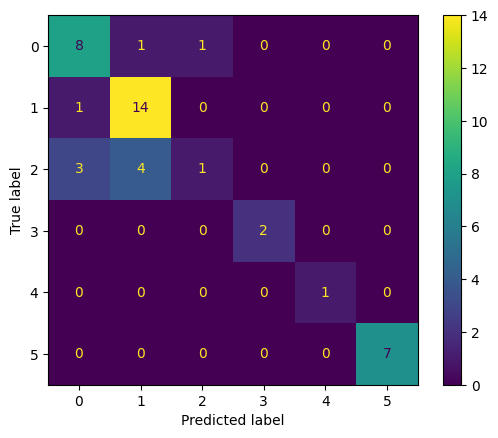
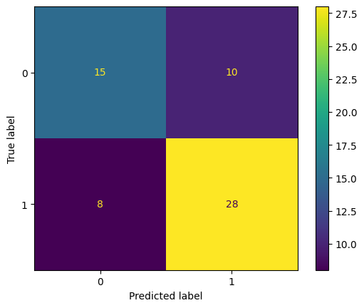
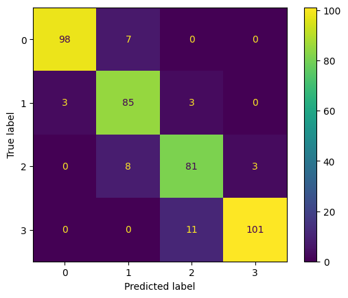

## Zbiór danych: animals

| Metryka | Klasyczne drzewo decyzyjne | Rozmyte drzewo decyzyjne 
| --- | --- | --- 
| Czas budowy [ms] |  1.45721435546875  |  8.97979736328125
| Czas użycia [ms] |  0.09393692016601562  |  0.13494491577148438
| Dokładność |  0.9523809523809523  |  0.9523809523809523
| Precyzja makro | 0.7142857142857143  |  0.7142857142857143
| Precyzja mikro | 0.9523809523809523  |  0.9523809523809523
| Czułość makro | 0.7142857142857143  |  0.7142857142857143
| Czułość mikro | 0.9523809523809523  |  0.9523809523809523
| F1 makro | 0.7142857142857143  |  0.7142857142857143
| F1 mikro | 0.9523809523809523  |  0.9523809523809523
| Macierz błędów |   |  

---

## Zbiór danych: fetal_health

| Metryka | Klasyczne drzewo decyzyjne | Rozmyte drzewo decyzyjne 
| --- | --- | --- 
| Czas budowy [ms] |  8.036136627197266  |  89666.00298881531
| Czas użycia [ms] |  0.07891654968261719  |  20.978927612304688
| Dokładność |  **0.9272300469483568**  |  0.9248826291079812
| Precyzja makro | 0.8781773108432261  |  **0.9214287001495739**
| Precyzja mikro | **0.9272300469483568**  |  0.9248826291079812
| Czułość makro | **0.9121950614407511**  |  0.8313550619585102
| Czułość mikro | **0.9272300469483568**  |  0.9248826291079812
| F1 makro | **0.8944282811226346**  |  0.8712696199001737
| F1 mikro | **0.9272300469483568**  |  0.9248826291079812
| Macierz błędów |   |  

---

## Zbiór danych: glass

| Metryka | Klasyczne drzewo decyzyjne | Rozmyte drzewo decyzyjne 
| --- | --- | --- 
| Czas budowy [ms] |  0.6201267242431641  |  2214.6801948547363
| Czas użycia [ms] |  0.051975250244140625  |  1.1150836944580078
| Dokładność |  0.7441860465116279  |  **0.7674418604651163**
| Precyzja makro | **0.7630291005291006**  |  0.6648809523809524
| Precyzja mikro | 0.7441860465116279  |  **0.7674418604651163**
| Czułość makro | **0.7765151515151515**  |  0.6644119769119768
| Czułość mikro | 0.7441860465116279  |  **0.7674418604651163**
| F1 makro | **0.6990344622697564**  |  0.659571702244116
| F1 mikro | 0.7441860465116278  |  **0.7674418604651162**
| Macierz błędów |   |  

---

## Zbiór danych: heart_attack

| Metryka | Klasyczne drzewo decyzyjne | Rozmyte drzewo decyzyjne 
| --- | --- | --- 
| Czas budowy [ms] |  0.5500316619873047  |  1346.1709022521973
| Czas użycia [ms] |  0.03790855407714844  |  1.386880874633789
| Dokładność |  0.819672131147541  |  0.819672131147541
| Precyzja makro | **0.826797385620915**  |  0.8193548387096774
| Precyzja mikro | 0.819672131147541  |  0.819672131147541
| Czułość makro | **0.8232758620689655**  |  0.8200431034482758
| Czułość mikro | 0.819672131147541  |  0.819672131147541
| F1 makro | **0.8194780737153619**  |  0.8194780737153617
| F1 mikro | 0.819672131147541  |  0.819672131147541
| Macierz błędów |   |  

---

## Zbiór danych: mobile_price_train

| Metryka | Klasyczne drzewo decyzyjne | Rozmyte drzewo decyzyjne 
| --- | --- | --- 
| Czas budowy [ms] |  7.650136947631836  |  182171.00429534912
| Czas użycia [ms] |  0.07200241088867188  |  28.44977378845215
| Dokładność |  0.8275  |  **0.9125**
| Precyzja makro | 0.8245807493599755  |  **0.9110206137010463**
| Precyzja mikro | 0.8275  |  **0.9125**
| Czułość makro | 0.8220999562032172  |  **0.9124049410734194**
| Czułość mikro | 0.8275  |  **0.9125**
| F1 makro | 0.8215354367350738  |  **0.9107510030783866**
| F1 mikro | 0.8275  |  **0.9125**
| Macierz błędów |   |  

---

