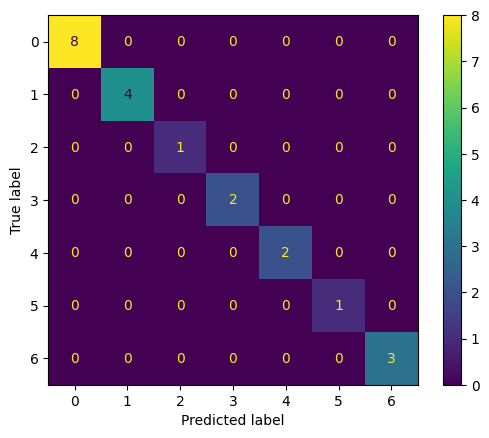

## Zbiór danych: animals

| Metryka | Klasyczne drzewo decyzyjne | Rozmyte drzewo decyzyjne 
| ------- | -------------------------- | ------------------------ 
| Czas budowy [ms] |  1.750946044921875  |  8.453845977783203
| Czas użycia [ms] |  0.12087821960449219  |  0.11372566223144531
| Dokładność |  0.9523809523809523  |  0.9523809523809523
| Precyzja | 0.7142857142857143  |  0.7142857142857143
| Czułość | 0.7142857142857143  |  0.7142857142857143
| Macierz błędów |   |  

---

## Zbiór danych: fetal_health

| Metryka | Klasyczne drzewo decyzyjne | Rozmyte drzewo decyzyjne 
| ------- | -------------------------- | ------------------------ 
| Czas budowy [ms] |  8.360862731933594  |  89763.18597793579
| Czas użycia [ms] |  0.2627372741699219  |  20.86615562438965
| Dokładność |  **0.9272300469483568**  |  0.9248826291079812
| Precyzja | **0.886135023114937**  |  0.8313550619585102
| Czułość | **0.9079877291084189**  |  0.8313550619585102
| Macierz błędów |   |  

---

## Zbiór danych: glass

| Metryka | Klasyczne drzewo decyzyjne | Rozmyte drzewo decyzyjne 
| ------- | -------------------------- | ------------------------ 
| Czas budowy [ms] |  0.6330013275146484  |  2226.722002029419
| Czas użycia [ms] |  0.0438690185546875  |  1.0938644409179688
| Dokładność |  **0.813953488372093**  |  0.7674418604651163
| Precyzja | **0.8505291005291005**  |  0.6644119769119768
| Czułość | **0.9015151515151515**  |  0.6644119769119768
| Macierz błędów |   |  

---

## Zbiór danych: heart_attack

| Metryka | Klasyczne drzewo decyzyjne | Rozmyte drzewo decyzyjne 
| ------- | -------------------------- | ------------------------ 
| Czas budowy [ms] |  0.5688667297363281  |  1339.3981456756592
| Czas użycia [ms] |  0.03814697265625  |  1.416921615600586
| Dokładność |  0.819672131147541  |  0.819672131147541
| Precyzja | **0.835**  |  0.8200431034482758
| Czułość | **0.8248922413793103**  |  0.8200431034482758
| Macierz błędów |   |  

---

## Zbiór danych: mobile_price_train

| Metryka | Klasyczne drzewo decyzyjne | Rozmyte drzewo decyzyjne 
| ------- | -------------------------- | ------------------------ 
| Czas budowy [ms] |  7.672786712646484  |  182497.39480018616
| Czas użycia [ms] |  0.07390975952148438  |  28.329849243164062
| Dokładność |  0.825  |  **0.9125**
| Precyzja | 0.8227597876755797  |  **0.9124049410734194**
| Czułość | 0.8194124263417742  |  **0.9124049410734194**
| Macierz błędów |   |  

---

